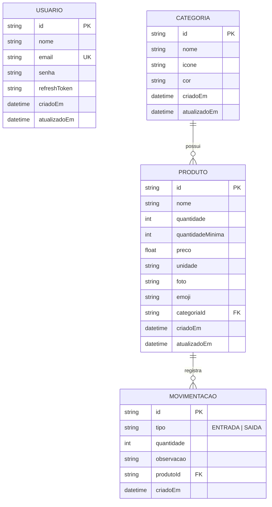

# 📦 ProEstoque - Sistema de Gestão de Estoque e Movimentação

> **ProEstoque** é uma solução completa para controle e gerenciamento inteligente de estoque, com aplicativo móvel (React Native / Expo) e uma API RESTful (Node.js / Express / Prisma).


---

## 📌 Índice

- [Visão Geral](#-visão-geral)
- [Funcionalidades](#-funcionalidades)
- [Arquitetura do Sistema](#-arquitetura-do-sistema)
- [Tecnologias Utilizadas](#-tecnologias-utilizadas)
- [Estrutura do Projeto](#-estrutura-do-projeto)
- [Modelo de Dados (ERD)](#-modelo-de-dados-erd)
- [Documentação da API REST](#-documentação-da-api-rest)
- [Instalação e Configuração](#-instalação-e-configuração)
  - [Pré-requisitos](#pré-requisitos)
  - [1. Backend (proestoque-api)](#1-backend-proestoque-api)
  - [2. Frontend Mobile (my-app)](#2-frontend-mobile-my-app)
- [Conexão Mobile x Backend](#-conexão-mobile-x-backend)
- [Licença](#-licença)

---

## 🎯 Visão Geral

O **ProEstoque** foi desenvolvido para simplificar o controle de inventário de pequenas e médias empresas. Ele permite cadastrar produtos, categorias personalizadas, monitorar itens em nível crítico de estoque e registrar movimentações detalhadas de **Entrada** e **Saída** de mercadorias.

A aplicação conta com autenticação segura baseada em **JWT** e **Refresh Tokens**, interface fluida no dispositivo móvel e sincronização em tempo real com o banco de dados backend.

---

## 🚀 Funcionalidades

### 🔐 Autenticação & Perfil
- Cadastro e Login de usuários.
- Autenticação via **JWT (JSON Web Token)** com controle de expiração e **Refresh Token**.
- Recuperação de senha e encerramento de sessão (Logout).
- Armazenamento seguro do token no dispositivo móvel via `@react-native-async-storage/async-storage`.

### 📊 Dashboard Inteligente
- Painel com resumo estatístico do estoque em tempo real.
- Contador de produtos totais, valor acumulado e categorias ativas.
- **Alertas de Estoque Baixo**: Notificação visual para produtos abaixo da quantidade mínima cadastrada.
- Histórico rápido com as últimas movimentações realizadas.

### 📦 Gestão de Produtos (CRUD)
- Cadastro de produtos com nome, quantidade inicial, quantidade mínima (alerta), preço unitário, unidade de medida (un, kg, pct, etc.), emoji/foto representativa e vínculo com categoria.
- Edição e remoção de produtos.
- Pesquisa em tempo real por nome do produto.
- Filtros dinâmicos: por Categoria ou Status do Estoque (Todos, Em Estoque, Estoque Baixo, Esgotado).

### 🔄 Movimentações de Estoque
- Registro prático de **Entrada (+)** e **Saída (-)** de produtos.
- Adição de observações/justificativas por movimentação.
- Histórico completo de movimentações ordenado cronologicamente.
- Atualização automática do saldo em estoque e validação para evitar saídas superiores ao saldo existente.

### 🏷️ Categorização Customizada
- Criação e gerenciamento de categorias de produtos.
- Atribuição de ícones (`Ionicons`) e paleta de cores para cada categoria.

---

## 🏗 Arquitetura do Sistema

O projeto adota uma arquitetura cliente-servidor desacoplada:

```mermaid
graph TD
    subgraph Mobile App (React Native / Expo)
        UI[Expo Router UI] --> Context[AuthContext & Storage]
        Context --> Axios[Axios API Client + Interceptors]
    end

    subgraph Backend (Node.js REST API)
        Axios -->|HTTP / JSON + Bearer JWT| Express[Express Server]
        Express --> AuthMw[Middleware de Autenticação JWT]
        AuthMw --> Controllers[Controllers / Schemas Zod]
        Controllers --> Prisma[Prisma ORM]
        Prisma --> SQLite[(SQLite Database dev.db)]
    end
```

---

## 🛠 Tecnologias Utilizadas

### 📱 Frontend Mobile (`my-app`)
- **Framework**: [React Native](https://reactnative.dev/) com [Expo](https://expo.dev/) (SDK 54)
- **Navegação**: [Expo Router](https://docs.expo.dev/router/introduction/) (File-based Routing)
- **Linguagem**: TypeScript
- **Estilização & Componentes**: React Native StyleSheet, Lucide / `@expo/vector-icons`, React Native Reanimated
- **Formulários & Validação**: `react-hook-form` + `zod`
- **Consumo de API**: `axios` com interceptores de Token / Refresh Token
- **Persistência Local**: `@react-native-async-storage/async-storage`

### ⚙️ Backend API (`proestoque-api`)
- **Ambiente de Execução**: [Node.js](https://nodejs.org/)
- **Framework Web**: [Express.js](https://expressjs.com/)
- **Linguagem**: TypeScript (`ts-node-dev` para desenvolvimento)
- **ORM & Banco de Dados**: [Prisma ORM](https://www.prisma.io/) + [SQLite](https://www.sqlite.org/) (`better-sqlite3`)
- **Autenticação**: `jsonwebtoken` (JWT) + `bcrypt` (Criptografia de Senhas)
- **Validação de Dados**: `zod`
- **CORS & Segurança**: `cors`, `dotenv`, `express-async-errors`

---

## 📂 Estrutura do Projeto

```text
proestoque/
├── README.md                 # Documentação principal do projeto
├── proestoque-api/           # Backend (API REST Node.js + Express + Prisma)
│   ├── prisma/
│   │   ├── schema.prisma     # Definição das tabelas e relacionamentos
│   │   └── seed.ts           # Dados iniciais para população do banco
│   ├── src/
│   │   ├── config.ts         # Variáveis de ambiente e segredos
│   │   ├── controllers/      # Controladores das rotas HTTP
│   │   ├── middlewares/      # Interceptores (Auth, Tratamento de Erros)
│   │   ├── routes/           # Rotas Express (Auth, Produtos, Categorias)
│   │   ├── schemas/          # Schemas Zod para validação das requisições
│   │   ├── app.ts            # Configuração do Express
│   │   └── server.ts         # Inicialização do servidor HTTP
│   ├── .env                  # Variáveis de ambiente do backend
│   └── package.json
│
└── my-app/                   # Frontend (App Mobile React Native Expo Router)
    ├── app/                  # Rotas da aplicação (Expo Router)
    │   ├── (auth)/           # Tela de Login, Cadastro, Recuperar Senha
    │   ├── (tabs)/           # Abas principais (Dashboard, Produtos, Configurações)
    │   │   └── produtos/     # Lista, Detalhes, Cadastro e Movimentações
    │   ├── _layout.tsx       # Root layout com AuthProvider
    │   └── index.tsx
    ├── src/
    │   ├── components/       # Componentes de UI reutilizáveis
    │   ├── constants/        # Cores, estilos globais e configurações
    │   ├── contexts/         # AuthContext (Gestão global do estado de login)
    │   ├── services/         # Integração com a API (Axios cliente)
    │   ├── schemas/          # Schemas Zod de formulários
    │   └── types/            # Interfaces e definições TypeScript
    ├── .env                  # Variáveis de ambiente do app (EXPO_PUBLIC_API_URL)
    └── package.json
```

---

## 🗄 Modelo de Dados (ERD)

Representação das entidades gerenciadas no banco de dados SQLite via Prisma ORM:



---

## 🌐 Documentação da API REST

A API disponibiliza os seguintes endpoints (prefixo `/api`):

### 🔐 Autenticação (`/api/auth`)
| Método | Rota | Autenticado | Descrição |
| :--- | :--- | :---: | :--- |
| `POST` | `/auth/cadastro` | ❌ | Realiza o registro de um novo usuário. |
| `POST` | `/auth/login` | ❌ | Autentica o usuário e retorna o Token JWT e Refresh Token. |
| `POST` | `/auth/refresh` | ❌ | Gera um novo Token de acesso usando o Refresh Token. |
| `GET` | `/auth/me` | 🔒 | Retorna os dados do usuário autenticado. |

### 🏷️ Categorias (`/api/categorias`)
| Método | Rota | Autenticado | Descrição |
| :--- | :--- | :---: | :--- |
| `GET` | `/categorias` | 🔒 | Lista todas as categorias cadastradas. |
| `POST` | `/categorias` | 🔒 | Cadastra uma nova categoria (Nome, Ícone, Cor). |
| `PUT` | `/categorias/:id` | 🔒 | Atualiza os dados de uma categoria existente. |
| `DELETE` | `/categorias/:id` | 🔒 | Remove uma categoria. |

### 📦 Produtos & Movimentações (`/api/produtos`)
| Método | Rota | Autenticado | Descrição |
| :--- | :--- | :---: | :--- |
| `GET` | `/produtos` | 🔒 | Lista produtos com filtros opcionais (categoria, busca, status). |
| `GET` | `/produtos/:id` | 🔒 | Retorna os detalhes de um produto específico. |
| `POST` | `/produtos` | 🔒 | Cadastra um novo produto no estoque. |
| `PUT` | `/produtos/:id` | 🔒 | Atualiza as informações do produto. |
| `DELETE` | `/produtos/:id` | 🔒 | Remove o produto do sistema. |
| `POST` | `/produtos/:id/movimentacao` | 🔒 | Registra entrada ou saída de itens no estoque. |
| `GET` | `/produtos/:id/movimentacoes` | 🔒 | Lista o histórico de movimentações de um produto. |

---

## ⚡ Instalação e Configuração

### Pré-requisitos

Certifique-se de ter instalado em sua máquina:
- [Node.js](https://nodejs.org/) (versão LTS recomendada: v18 ou superior)
- [npm](https://www.npmjs.com/) ou [yarn](https://yarnpkg.com/)
- [Expo Go](https://expo.dev/go) instalado em seu dispositivo móvel (Android/iOS) **OU** um Emulador configurado (Android Studio / Xcode).

---

### 1. Backend (`proestoque-api`)

1. Navegue até a pasta da API:
   ```bash
   cd proestoque-api
   ```

2. Instale as dependências:
   ```bash
   npm install
   ```

3. Configure o arquivo de ambiente `.env` (se necessário):
   ```env
   PORT=3333
   DATABASE_URL="file:./dev.db"
   JWT_SECRET="sua_chave_secreta_aqui"
   JWT_EXPIRES_IN="5s"
   JWT_REFRESH_EXPIRES_IN="30d"
   ```

4. Execute as migrações do Prisma e popule o banco de dados (Seed):
   ```bash
   npx prisma db push
   npm run seed
   ```

5. Inicie o servidor de desenvolvimento:
   ```bash
   npm run dev
   ```
   *O servidor estará rodando em:* `http://localhost:3333`

---

### 2. Frontend Mobile (`my-app`)

1. Navegue até a pasta do aplicativo:
   ```bash
   cd my-app
   ```

2. Instale as dependências:
   ```bash
   npm install
   ```

3. Configure o arquivo `.env` informando o IP da sua máquina na rede local:
   ```env
   EXPO_PUBLIC_API_URL=http://<SEU_IP_LOCAL>:3333/api
   ```
   > 💡 **Exemplo:** `EXPO_PUBLIC_API_URL=http://192.168.1.15:3333/api`

4. Inicie o projeto Expo:
   ```bash
   npx expo start
   ```

5. Escaneie o QR Code exibido no terminal utilizando o aplicativo **Expo Go** no seu celular, ou pressione `a` para abrir no emulador Android, ou `w` para versão Web.

---

## 📱 Conexão Mobile x Backend

Ao testar em um **dispositivo físico** conectado à mesma rede Wi-Fi do seu computador:
1. Descubra o IP local da sua máquina:
   - **Windows**: Digite `ipconfig` no terminal e copie o IPv4 (ex: `192.168.3.26`).
   - **Linux/macOS**: Digite `ifconfig` ou `ip a`.
2. Atualize o arquivo `my-app/.env` com esse IP.
3. Certifique-se de que a porta `3333` não está bloqueada pelo Firewall do Windows.

---

## 📄 Licença

Este projeto foi desenvolvido como trabalho prático para a disciplina de **Desenvolvimento de Aplicações Móveis**.

---

<p center="align">
  Desenvolvido com 💙 por Vitor Souza
</p>
